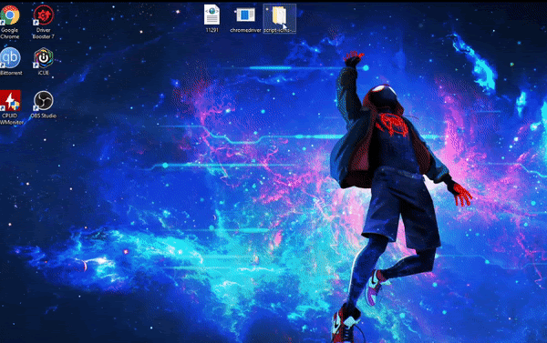
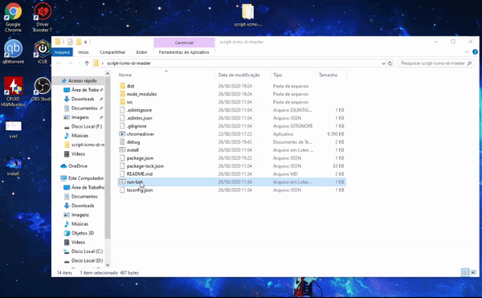

# GNRE Generate

    Um bot para calcular o ICMS ST de uma nota fiscal a partir de um XML e emitir a GNRE em poucos segundos.  
    <em>Somente no estado do Paraná.</em>

## 🚀 Como instalar e iniciar o bot?

### 1. Instalação do Node.js
- Baixe e instale o Node.js a partir do [site oficial](https://nodejs.org/en/download/).

### 2. Download do bot
- Baixe o bot a partir do [repositório no GitHub](https://github.com/filipewk/script-icms-st/archive/master.zip).

### 3. Verificação da versão do Chrome
- Verifique a versão do seu Chrome e baixe o ChromeDriver correspondente.

### 4. Download do ChromeDriver
- Baixe o ChromeDriver a partir do [site oficial](https://chromedriver.chromium.org/downloads).

### 5. Configuração do ChromeDriver
- Mova o ChromeDriver baixado para a raiz do projeto do bot.

### 6. Instalação das dependências
- Na pasta do bot, execute `install.bat` para instalar as dependências necessárias.

### 7. Preparação dos arquivos XML
- Mova os arquivos XML para a pasta `dist/data/xml`.

### 8. Nomeação dos arquivos XML
- Certifique-se de que o nome do arquivo XML corresponde ao número da NFE que será fornecido no passo seguinte.

### 9. Execução do bot
- Execute `run-bot.bat` e preencha os dados solicitados (número da NFE, mva a 12%, mva a 04%, alíquota interna, data de vencimento).

## 🚀 Início Rápido em 5 Minutos

### 1. Instalação

 
  

### 2. Preparação do XML para leitura

 
  

### 3. Execução do Bot

 
  

## 👥 Contribuidores

- [filipewk](https://instagram.com/e3filipe)

## 💌 Licença

Este software foi criado apenas para fins de estudo. Sinta-se à vontade para experimentá-lo.
